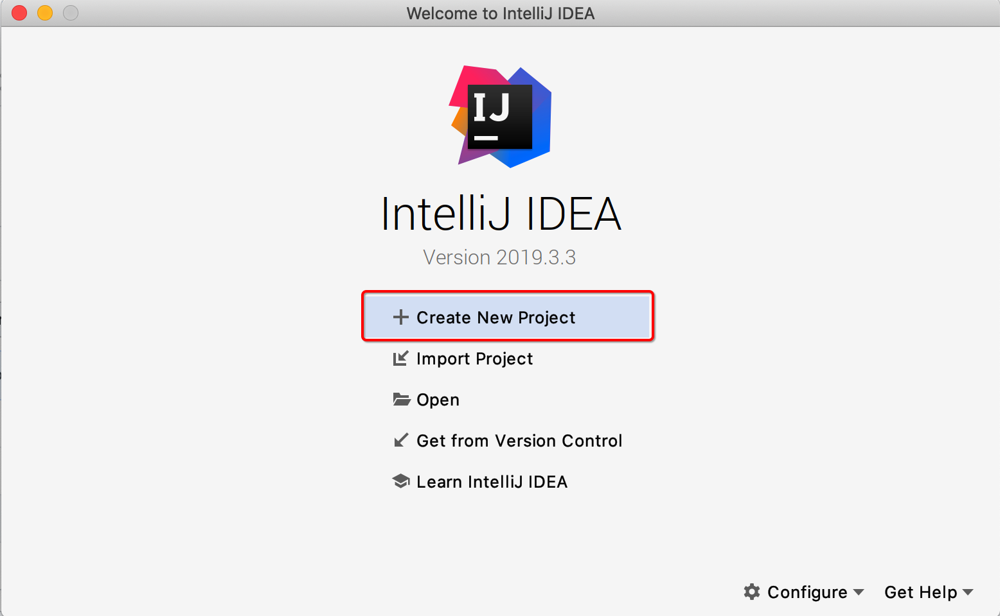

## 什么是Spring boot？
* SpringBoot 是由 Pivotal 团队提供的全新框架，其设计的目的是用来简化新 Spring 应用的初始化搭建以及开发过程。该框架使用了特定的方式来进行配置，从而使开发人员不再需要定义模版化的配置。


Spring boot 特性
1. 创建独立的 Spring 应用程序
2. 嵌入的 Tomcat，无需部署 war 文件
3. 简化 Maven 配置
4. 自动配置 Spring
5. 提供生产就绪型功能，如指标，健康检查和外部配置
6. 开箱即用，没有代码生成，也无需 xml 配置。
（Spring boot 并不是对 Spring 功能上对增强，而是提供一种快速使用 Spring 对方式。）


开发环境准备
* 开发环境 JDK 1.8
* 开发工具 Eclipse\idea
* 项目管理工具 Maven 


1. 创建一个 Maven 项目
    
    
    
    
    

2. 修改 pom.xml 配置
    
    ```xml
    <!-- spring boot 父节点依赖：引入之后，spring 相关的依赖就不需要填写版本信息， spring boot 会自动选择最合适的版本进行添加 -->
    <parent>
        <groupId>org.springframework.boot</groupId>
        <artifactId>spring-boot-starter-parent</artifactId>
        <version>2.2.5.RELEASE</version>
        <relativePath/> <!-- lookup parent from repository -->
    </parent>

    <!-- https://mvnrepository.com/artifact/org.springframework.boot/spring-boot-starter-web -->
    <!-- spring-boot-starter-web：提供的是 spring mvc 相关的依赖包  -->
    <dependency>
      <groupId>org.springframework.boot</groupId>
      <artifactId>spring-boot-starter-web</artifactId>
      <version>2.2.5.RELEASE</version>
    </dependency>

    ```
3. codeing
    
    1.1 编写启动类
    ```java
    package org.example;

    import org.springframework.boot.SpringApplication;
    import org.springframework.boot.autoconfigure.SpringBootApplication;

    /**
    * Hello world!
    *
    */
    @SpringBootApplication
    public class App 
    {
        public static void main( String[] args )
        {
            SpringApplication.run(App.class, args);
        }
    }

    ```

    1.2 编写控制器

    ```java
    package org.example.controller;

    import org.springframework.web.bind.annotation.RequestMapping;
    import org.springframework.web.bind.annotation.RestController;

    @RestController
    public class HelloController {

        @RequestMapping("/hello")
        public String hello() {
            return "hello world!";
        }
    }

    ```